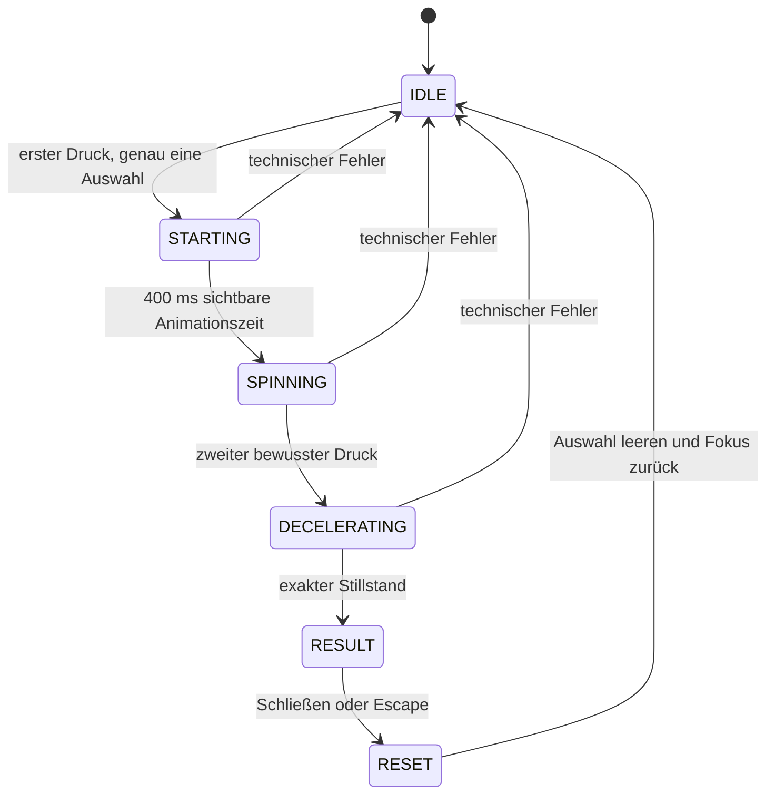

# Implementierungsplan — Thüringen-Glücksrad

## Verbindlicher Umfang und Stand

Dieser aktualisierte Plan ersetzt die ursprüngliche Greenfield-Planung. Maßgeblich ist der beauftragte Start-/Stopp-Ablauf mit gleichen Feldwahrscheinlichkeiten, lokalem Ton und manueller Rückkehr zum Spiel. Schrift und eigene SVG-Symbole dürfen vorläufig bleiben. Die frühere automatische Drehsequenz, offene Wahrscheinlichkeitsentscheidung und vollständige Eingabesperre während der Dauerrotation sind damit abgelöst.

**Rad drücken → fortlaufend drehen → erneut drücken → abbremsen → Ergebnis-Popup → schließen → erneut spielbereit.**

Die Anwendung ist implementiert. Den abschließenden automatisierten Prüfstand und die separat offenen Abnahmen führt dieser Plan unten auf. Es gibt keine Veröffentlichung und keine Änderungen am Eventdisplay.

## Umsetzung

| Arbeitspaket | Status | Nachweis |
| --- | --- | --- |
| Next.js App Router, strenges TypeScript, npm, CSS Modules | Implementiert | `package.json`, `package-lock.json`, `tsconfig.json`, `src/app/` |
| Exakte Paketversionen, lokale Laufzeit und Startbefehle | Implementiert | `.nvmrc`, `.npmrc`, README |
| Acht Segmente, Reihenfolge und digitale Palette | Implementiert | `config/wheel.ts`, `components/Wheel.tsx` |
| Vier unveränderte Beschreibungen einschließlich „Hüfte“ | Implementiert | `config/wheel.ts`, Originaltext-Tests |
| Gleichverteilung und Auswahl einmal beim Start | Implementiert | `selection/uniform.ts`, Grenzwerttests |
| Startschutz, zweiter Druck, synchrone Sperren | Implementiert | `useWheelGame.ts`, `domain/machine.ts`, Interaktionstests |
| Beschleunigung, endlose Rotation, genaues Abbremsen | Implementiert | `animation/controller.ts`, `animation/geometry.ts` |
| Ton, Stummschaltung, Tabpause, reduzierte Bewegung | Implementiert | `audio/clicks.ts`, Controller, Browserprüfungen |
| Ergebnisdialog, Escape, Fokus und Wiederholung | Implementiert | `components/ResultDialog.tsx`, Browserprüfungen |
| Lokaler Betrieb nach Verbindungsverlust | Implementiert | Mehrere Offline-Runden im Browser |
| Layoutmatrix und lange Ergebnisbeschreibungen | Implementiert und geprüft | Playwright-Bilder und axe-Prüfungen |
| Betrieb, Grenzen und Übergabe | Dokumentiert | README und BETRIEB.md |
| Finale Markenassets, Hosting, echtes Eventdisplay | Offen | Separate Abnahmeliste unten |

## Regeln und Originalinhalte

Jedes Feld hat 12,5 % Wahrscheinlichkeit, jede Kategorie mit ihren beiden Feldern 25 %. `crypto.getRandomValues` erzeugt genau einen Uint32-Wert pro Rundenstart. Acht gleich große Intervalle teilen den gesamten Wertebereich ohne Rundungs- oder Modulo-Verzerrung auf. Der Stoppzeitpunkt verändert die Auswahl nicht. Es werden keine Kontingente oder vergangenen Ergebnisse berücksichtigt.

Die Beschreibungen stehen zentral und unverändert in der Konfiguration:

- Kaffee: `Premium-Kaffee von der Thüringer DenkMahl Rösterei`
- Wein: `Prämierter Wein vom Thüringer Weingut Bad Sulza`
- Hauptgewinn: `Hauptgewinn! „Hüfte“ mit deiner Visitenkarte & Newsletter-Anmeldung in den Lostopf für einen Freiplatz auf unserer B2B-Entdeckungsreise vom 29. bis 31.10.26`
- Niete: `Niete – aber keine Sorge, in Thüringen geht niemand leer aus! Melde dich zu unserem Newsletter an & folge uns bei LinkedIn!`

„Hüfte“ bleibt ausdrücklich bestehen. Newsletter, Visitenkarte und LinkedIn sind ausschließlich Teile der gelieferten Beschreibung; ihre Erwähnung implementiert keine Registrierung. Der Hauptgewinntext beschreibt einen Lostopf für einen Freiplatz.

| Index im Uhrzeigersinn | Kategorie | Fläche | Vordergrund |
| --- | --- | --- | --- |
| 0 | Kaffee | `#0089C1` | `#FFFFFF` |
| 1 | Wein | `#EFF2F8` | `#435167` |
| 2 | Hauptgewinn | `#FFB400` | `#435167` |
| 3 | Niete | `#435167` | `#FFFFFF` |
| 4 | Wein | `#36C3F0` | `#435167` |
| 5 | Kaffee | `#D5DAE5` | `#435167` |
| 6 | Niete | `#FF6565` | `#435167` |
| 7 | Hauptgewinn | `#1ED671` | `#435167` |

Weitere digitale Tokens: Grau `#8691A8`, Weiß `#FFFFFF`. Schatten, Ringe und transparente Flächen verwenden ausschließlich Ableitungen dieser Palette. Kleine Feldtexte liegen auf kontrastierenden Plaketten; Symbole behalten den angegebenen Vordergrund.

## Zustandsfolge und Eingaben



- Das gesamte Rad ist ein semantischer Button mit Touch-, Maus-, Enter- und Leertastenbedienung.
- Während `STARTING`, `DECELERATING` und `RESULT` werden weitere Aktivierungen ignoriert. `SPINNING` nimmt genau den Stopp entgegen.
- Der Zustand wird synchron in einer Ref gesperrt und anschließend gerendert; die Auswahl wird vor dem Animationsbeginn unveränderlich abgelegt.
- Sekundäre Pointer und in einer Sperrphase begonnene Berührungen werden verworfen. Tastaturwiederholung startet oder stoppt nicht erneut.
- Vorgangskennungen entwerten alte Callbacks bei Reset, Fehlern und Unmount.
- Die Auswahl bleibt bis zum Schließen erhalten. Der nächste Durchlauf startet vom zuletzt sichtbaren Winkel.

## Geometrie, Animation und Audio

Einheitliche Konvention: 0° oben, positive Winkel im Uhrzeigersinn, Feldzentrum `i × 45°`, Feldgrenzen ±22,5° um dieses Zentrum. Der feststehende Zeiger liegt oben. Der Endwinkel ist `−i × 45°` modulo 360° und wird mit mindestens zwei zusätzlichen Umdrehungen vom aktuellen Winkel erreicht.

Die native Web Animations API beschleunigt in 400 ms quadratisch auf 360°/s. Eine lineare Animation mit unendlich vielen Wiederholungen setzt fort, bis die Bedienung stoppt. Die quadratische Abbremsung beginnt mit derselben Geschwindigkeit und dauert `2 × Strecke / 360` Sekunden, also vier bis unter sechs Sekunden. Das Ziel wird in den statischen Transform geschrieben, bevor das Ergebnis geöffnet wird.

Animation und Klicks lesen dieselbe WAAPI-Zeit. Ein einzelner `requestAnimationFrame`-Sampler erkennt Segmentgrenzen, ohne React pro Bild zu aktualisieren. Nach einem verzögerten Frame wird höchstens ein Klick gespielt; verpasste Klicks werden nicht nachgeholt. Audio verwendet leise, kurz ausklingende Oszillatoren und trennt die Audioknoten danach ab.

Bei reduzierter Bewegung bleibt das Rad während Start und Spiel still. Der zweite Druck richtet es sofort auf das Ziel aus und blendet es über 180 ms ein. Die beiden bewussten Druckaktionen bleiben erhalten. Die Bewegungspräferenz wird beim Rundenstart gelesen.

Bei verborgenem Dokument pausieren WAAPI und Audio; bei Rückkehr setzen sie fort. Audiofehler werden abgefangen. Animationsfehler führen mit einem verständlichen Hinweis zurück nach `IDLE`; eine unvollständige Runde wird verworfen.

## Dialog, Darstellung und lokale Bündelung

Das native `dialog` öffnet erst nach Stillstand, zeigt Symbol, Kategorie, Überschrift und unveränderte Beschreibung. Ein hervorgehobener Rand markiert das Gewinnerfeld. Schließen-Button und Escape setzen zurück; Hintergrundklick tut nichts. Fokus geht in den Dialog und anschließend zum Rad zurück. Lange Inhalte sind bei Bedarf scrollbar; kein automatisches Schließen.

Die Oberfläche ist deutsch, die Ton- und Dialogbuttons sind mindestens 64 CSS-Pixel hoch, das Rad selbst ist eine große Touchfläche. Die Zielmatrix umfasst 1920 × 1080, 1366 × 768, 1280 × 800 und 1024 × 768. Kleinere Ansichten erhalten eine gestapelte Darstellung, sind jedoch nicht die primäre Geräteabnahme.

Schrift, Wortmarke und Symbole sind dokumentierte Platzhalter: lokale Systemschrift und eigene einfache SVGs. Es existieren keine externen Font-/Asset-Requests, nachgeladenen Spielmodule oder öffentlichen Spiel-APIs. Bereits geladene Runden benötigen kein Netzwerk. Offline-Kaltstart und Offline-Neuladen ohne lokalen Server sind nicht zugesichert.

## Architektur und Versionen

Die Zuständigkeiten liegen in getrennten Modulen unter `src/features/wheel/`: Konfiguration, Domain/Validierung/Zustandsautomat, Zufallsauswahl, Geometrie/Animationscontroller, Audio, Orchestrierung und React-Darstellung. Interfaces beschreiben Ergebnisse, Segmente, Phasen, Zufallsquelle und abbrechbaren Controller. Produktionscode enthält keine manipulierbaren Gewinnerparameter; Testabhängigkeiten und Browser-API-Substitution bleiben im Testaufbau.

Grundlage: Node.js 24.12.0, npm 11.11.0, Next.js 16.3.5, React/React DOM 19.3.0, TypeScript 6.0.3. Direkte Abhängigkeiten sind exakt festgehalten. Die Versionswahl wurde über npm-Paketmetadaten und die offizielle Next.js-Dokumentation geprüft. Vollständige Versionen stehen in `package.json` und `package-lock.json`.

```bash
npm ci
npm run dev
# oder für den lokalen Produktionsbetrieb:
npm run build
npm start
```

Der Server bindet lokal an `127.0.0.1:3000`. Testinstallation und Prüfbefehle stehen in README. Keine Umgebungsvariablen erforderlich.

## Prüfstand

| Prüfung | Ergebnis |
| --- | --- |
| Lockfile-Install mit `npm ci` (aus lokalem Cache, reguläre Install-Skripte aktiv) | Erfolgreich |
| `npm run lint` | Erfolgreich, keine Lintwarnungen |
| `npm run typecheck` | Erfolgreich |
| `npm test` | 47 Unit-/Komponententests in zwei Dateien bestanden |
| `npm run build` | Erfolgreicher Produktionsbuild, Startseite statisch vorgerendert |
| `npm run test:e2e` gegen Produktionsbuild | 18 Tests bestanden; letzter Gesamtlauf 52,6 Sekunden |
| axe auf Startseite und Hauptgewinn-Dialog in allen vier Zielauflösungen | Keine gemeldeten Verstöße |
| Sichtprüfung der erzeugten Layout-/Dialogbilder | Inhalt und Schließen-Button erreichbar; keine abgeschnittenen Zielansichten |

Für diesen lokalen Prüflauf lag der Testbrowser unter `/tmp/gluecksrad-browsers`; `PLAYWRIGHT_BROWSERS_PATH` wies auf diesen Ordner. Der Testserver lief ausschließlich auf `127.0.0.1:3100` und wurde anschließend beendet. Die normale Testinstallation ist in README beschrieben. Im eingeschränkten Arbeitsumfeld benötigten Registry-/Browserdownloads und der lokale Browser-Testserver Ausführungsfreigaben.

Der Build nutzt die TypeScript-6-Compiler-API (`experimental.useTypeScriptCli: false`), weil das Einlesen der CLI-Ausgabe im Build-Worker zunächst sporadisch fehlschlug. Die integrierte Typprüfung bleibt aktiviert; der separate Typecheck besteht ebenfalls.

Abgedeckte Szenarien:

- Konfiguration, Reihenfolge, Farben, zwei Felder je Kategorie und vier Originaltexte.
- Ungültige Konfiguration, Zufallsgrenzen, genau ein Zufallsaufruf und Web Crypto.
- Gültige/ungültige Zustandsübergänge, alle acht Zielwinkel aus unterschiedlichen Ausgangswinkeln.
- Erster/zweiter Druck, Doppelauslösung, Abbrems-Sperre, alle Ergebnistexte, Wiederholung, Fehler und veraltete Callbacks.
- Acht deterministische Ziele mit echter Produktionsanimation und sichtbarer SVG-Ausrichtung.
- Tastaturwiederholung, Enter/Leertaste, Dialogfokus, Escape, Hintergrundklick.
- Ruhiges Spiel bei reduzierter Bewegung, unbegrenzte Rotation, Pause/Fortsetzung, sprungfreier Stopp und vier bis sechs Sekunden Bremsdauer.
- Tatsächlicher AudioContext bei Tonumschaltung und Tabpause, optionaler Audioausfall, Animationsabbruch.
- Mehrere Offline-Runden nach vollständigem Laden ohne weitere Netzwerkanfragen.
- Vier Zielauflösungen, erreichbare lange Beschreibung, Screenshots und axe-Prüfungen.
- Emulierter Touch und überlappender sekundärer Pointer.

Die Sichtbarkeitssignale werden im Headless-Browser kontrolliert ausgelöst, da er echte Betriebssystem-Tabwechsel nicht zuverlässig abbildet. Der Testbrowser ist Chromium Headless Shell 153.0.8010.12, Playwright 1.63.0. Lautstärke und Hardwareleistung sind damit nicht abgenommen.

## Offene Abnahme und ausgeschlossener Umfang

Noch offen:

1. Finale FF-Meta-/Meta-Pro-Webfonts, Nutzungsrechte, offizielles Logo und Freigabe der Symbole/Farbanordnung.
2. Hosting und Auslieferungsweg, Browser-/Betriebssystemversion am Eventgerät, Vollbild-/Kioskverwaltung.
3. Echte Multitouch-, Lautstärke-, Lesbarkeits- und Performanceprüfung am 42-Zoll-Display; mindestens 30 Runden und reale Tab-/Fensterwechsel. Detaillierte Liste in BETRIEB.md.

Nicht umgesetzt: Kontingente, gewichtete Kategorien, Teilnehmererfassung, Speicherung/Statistik/Analytics, externe Links, Formulare, Newsletterintegration, Konfetti, Backend-Endpunkte, Service Worker, automatisches Dialogschließen, Deployment oder Geräteänderungen.

Die lokale Implementierung gilt als abgeschlossen, wenn Lockfile-Install, Lint, Typecheck, Unit-/Komponententests, Produktionsbuild und zentrale Browsertests erfolgreich sind. Die vorstehenden Marken-, Hosting- und Geräteabnahmen bleiben ausdrücklich separat offen.
